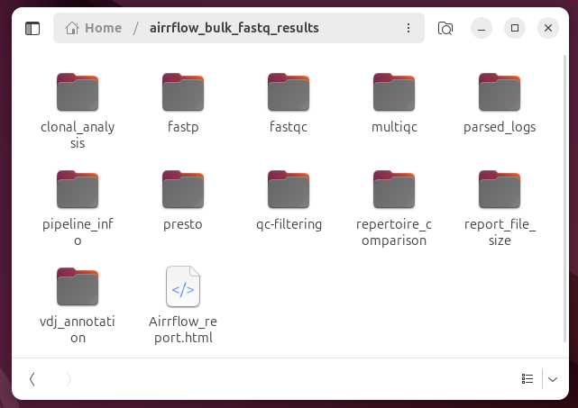

# nf-core/airrflow: Bulk Airr-seq tutorial

This tutorial provides a step by step introduction on how to run nf-core/airrflow on bulk Airr-seq data.

## Pre-requisites

> [!INSTALLATION]
> If you are new to Nextflow and nf-core, please refer to [this page](https://nf-co.re/docs/usage/installation) on how to set up Nextflow and a container engine needed to run this pipeline. At the moment, nf-core/airrflow does NOT support using conda virtual environments for dependency management, only containers are supported. Make sure to [test your setup](https://nf-co.re/docs/usage/introduction#how-to-run-a-pipeline) with `-profile test` before running the workflow on actual data.

For the purpose of running this tutorial on your local machine, we recommend a docker installation.

To install docker, follow the instructions [here](https://docs.docker.com/engine/install/). After installation on linux, don't forget to check the [post-installation steps](https://docs.docker.com/engine/install/linux-postinstall/).

## Testing the pipeline with built-in tests

Once you have set up your Nextflow and container (docker or singularity), test the airrflow pipeline with built-in test. 

```bash
nextflow run nf-core/airrflow -r 4.2.0 -profile test,docker --outdir test_results
```

## Running airrflow pipeline 

### Datasets
In this tutorial, we will use bulk BCR sequencing data from two subjects in fastq format. The first subject has 3 samples from lymph node and 1 sample from brain lesion while the second subject has 3 samples from lymph node and 3 samples from brain lesion. You don't need to download the samples bacause the links to the samples are already provided in the samplesheet. 

### Preparing files needed
To run the Airrflow pipeline on bulk BCR/TCR sequencing data, several files must be prepared in advance. 

- A tab-seperated samplesheet containing the information of each sample. Details on the requied columns of a samplesheet are available [here](https://nf-co.re/airrflow/usage#input-samplesheet). 

- A configuration file requiring memory, cpu and time. Before setting the configuration file, we recommend verifying the available memory and cpus on your system. Otherwise, exceeding the system's capacity may result in unexpected errors. 

- The sequences for the V-region primers as well as the C-region primers used in the specific PCR amplification. 

A prepared samplesheet for this tutorial can be found [here](bulk_sample_code/metadata_pcr_umi_airr_300.tsv), and the configuration file is available [here](bulk_sample_code/resource.config). 
Download both files to the directory where you intend to run the airrflow pipeline. 

The sequences for the V-region primers as well as the C-region primers are stored in AWS S3, and the links are provided in the Nextflow command which will be fetched by nextflow automatically when executing the command.  

### Running airrflow
With all the files ready, you can proceed to run the airrflow pipeline. 

```bash
nextflow run nf-core/airrflow -r 4.2.0 \
-profile docker \
--mode fastq \
--input metadata_pcr_umi_airr_300.tsv \
--cprimers 's3://ngi-igenomes/test-data/airrflow/pcr_umi/cprimers.fasta' \
--vprimers 's3://ngi-igenomes/test-data/airrflow/pcr_umi/vprimers.fasta' \
--library_generation_method specific_pcr_umi \
--cprimer_position R1 \
--umi_length 15 \
--umi_start 0 \
--umi_position R1 \
-c resource.config \
--outdir bulk_fastq_results \
-resume
```

Of course you can wrap all your code in a bash file. We prepared one for you and it's available [here](bulk_sample_code/airrflow_bulk_b_fastq.sh).
With the bash file, it's easy to run the pipeline with a single-line command. 

```bash
bash airrflow_bulk_b_fastq.sh
```

If no UMI barcodes were used, set the --library_generation_method to specific_pcr, and the UMI length will be set automatically to 0. 
Don't forget to modify the parameters (eg. --library_generation_method, --cprimer_position, --umi_length, --umi_start, --umi_position, etc.) if you run the pipeline on your own data. 

> [Tip]
> When launching a Nextflow pipelien with -resume option, any processes that have already been run with the exact same code, settings and inputs will be skipped. The benefit of using -resume is to avoid duplicating previous work and save time when re-running a pipeline.
> We include -resume in our Nextflow command  as a precaution in case anything goes wrong during execution. After fixing the issue, you can relaunch the pipeline with the same command, it will resume running from the point of failure, significantly reducing runtime and resource usage.  

## Understanding the results

After running the pipeline, several reports are generated under the result folder. 



The analysis steps and their corresponding folders, where the results are stored, are listed below. 


1. QC and sequence assembly 
   - PRESTO

2. V(D)J annotation and filtering. 
   - In this step, gene segments are assigned using a germline reference. Alignments are annotated in AIRR format. Non-productive sequences and sequences with low alignment quality are removed. Metadata is added. The results are under the folder named 'vdj_annotation'. 

3. QC filtering. 
   

4. Clonal analysis. 
   - In this step, the Hamming distance threshold of the junction regions is determined when clonal_threshold is set to 'auto' (by default). Once the threshold is established, clones are assigned to the sequences. The result is under the folder named 'clonal_analysis'. 
   - By default, the clonal_threshold is set to be 'auto', it should be reviewed for accuracy once the result is out. If the automatic threshold is unsatisfactory, you can set the threshold manually and rerun the pipeline. (Tip: use -resume whenever running the Nextflow pipeline to avoid duplicating previous work). 
   - For TCR data, where somatic hypermutation does not occur, set the clonal_threshold to 0 when running the Airrflow pipeline.  

5. Repertoire analysis and reporting. 
   - The output folders are 'repertoire_comparison', 'parsed_logs', 'report_file_size' and 'multiqc'. 


## Including lineage tree computation

Lineage tree computation is skipped by default because it's time-consuming. To enable lineage tree computation, re-run the pipeline with the --lineage_trees parameter set to true. Remember to include the -resume parameter to avoid duplicating previous work.