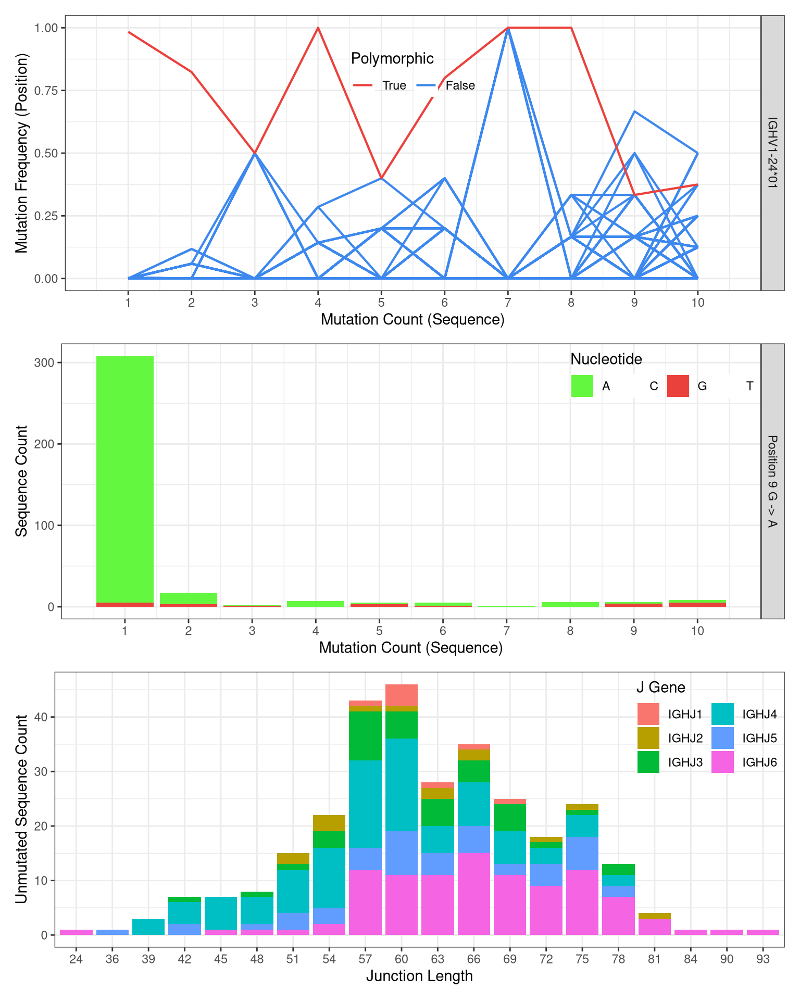

# nf-core/airrflow: novel allele detection and genotype inference tutorial

This tutorial provides an introduction on how to add novel allele detection and genotype inference to an nf-core/airrflow pipeline run. These optional steps are performed with [TIgGER](https://tigger.readthedocs.io/en/stable/) and are only applicable to BCR sequences.

## Pre-requisites

Novel allele detection and genotype inference are optional add-on steps in nf-core/airrflow pipeline. Before using these features, make sure you are familiar with the basic usage of the pipeline. If not, we recommend reviewing the bulk or single-cell tutorials before proceeding with this guide.

## How to add novel allele detection and genotype inference in the pipeline

To perform novel allele detection and genotype inference in nf-core/airrflow pipeline, simply add flag `--genotyping` in your command.

By default, with flag `--genotyping` on, the following steps will be executed before clonal inference:

1. Infer the presence of novel IGHV alleles not in the germline database.
2. Assign novel alleles to samples.
3. Infer clones and use one single representative sequence per clone for genotype inference.
4. Infer the personalized genotype of each subject.
5. Correct the allele calls of sequences based on the genotypes of subjects.

After these steps, we have more accurate allele calls for each subject for clonal inference and analysis.

## Testing novel allele detection and genotype inference with built-in tests

If you have set up Nextflow and Docker for your local machine, test nf-core/airrflow novel allele detection and genotype inference with the built-in test.

```bash
nextflow run nf-core/airrflow -r 5.1.0 -profile test_genotyping_small,docker --outdir test_genotyping_results
```

Change the `docker` profile to `singularity` if you use Codespaces since Docker currently cannot be used in Codespaces. You can first set up a Singularity cache directory which will allow the reuse of Singularity container across all runs:

```bash
mkdir singularity_cache
export NXF_SINGULARITY_CACHEDIR="/workspaces/airrflow/singularity_cache"
```

Then run nf-core/airrflow with the genotyping test data:

```bash
nextflow run nf-core/airrflow -r 5.1.0 -profile test_genotyping_small,singularity --outdir test_genotyping_results
```

> [!NOTE]
> The '-r' flag in the command specifies which nf-core/airrflow release to run. We recommend always [checking and using the latest release](https://nf-co.re/airrflow/releases_stats/).

> [!NOTE]
> Because Codespaces provides limited CPU and RAM resources, the test run may take 25 minutes. The process will be faster on systems with greater CPU and RAM capacity.

If the tests run through correctly, you should see this output in your command line:

-[nf-core/airrflow] Pipeline completed successfully-
Completed at: 01-May-2026 13:52:56
Duration : 25m 23s
CPU hours : 0.8 (0% cached)
Succeeded : 21
Cached : 2

## Understanding the results

After running the pipeline, several sub-folders are available under the results folder.

```bash
Airrflow_report.html
- cellranger
- vdj_annotation
- qc_filtering
- novel_alleles_and_genotyping
- clonal_analysis
- repertoire_comparison
- multiqc
- report_file_size
- pipeline_info
```

The results of novel allele detection and genotype inference are stored in the `novel_alleles_and_genotyping` subfolder. Within this directory, `01-novel_allele_inference` contains the novel allele detection results, and `02-genotype_inference` contains the genotype inference results.

1. Three types of evidence are used as criteria for detecting a novel allele. Plots of these evidences for each novel allele can be inspected in the html report in the folder 'novel_alleles_and_genotyping/01-novel_allele_inference/subject_id/subject_id_novel_allele_inference_report/index.html'.
   - The first piece of evidence involves taking all sequences which align to a particular Germline allele and regressing the mutation frequency at each position against the sequence-wide mutation count. While mutational hot-spots and cold-spots are both expected to have a y-intercept around zero, polymorphic positions will have a y-intercept larger than zero. The theory behind the evidence is that non-polymorphic positions would accumulate mutations at a frequency proportional to sequence-wide mutation counts, whereas polymorphic positions exhibits a high mutation frequency that is independent of the sequence-wide mutation count.

   - The second piece of evidence supporting novel allele calls is the nucleotide usage at the polymorphic positions as a function of sequence-wide mutation count. We expect the polymorphic allele to be prevalent at all mutation counts, and we expect the mutation count equal to the number of polymorphisms in the novel sequence to be the most prevalent.

   - Finally, to avoid cases where a clonal expansion might lead to a false positive, combinations of J gene and junction length are examined among sequences which perfectly match the proposed Germline allele. A true novel allele is expected to utilize a wide range of J genes, and to exist in sequences with different junction length.

Plots of three evidence for novel allele IGHV1-24\*01_G9A:

<p align="center">
  
</p>

2. Genotype inference plots can be found in html report in the folder 'novel_alleles_and_genotyping/02-genotype_inference/subject_id/subject_id_bayesian_genotype_inference_report/index.html'.
